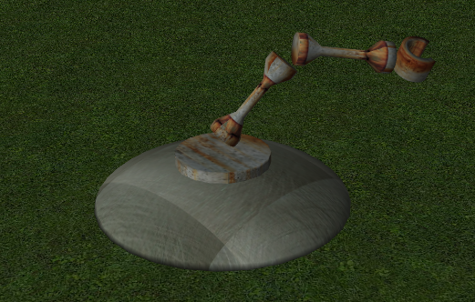

# cocos3d(2)
## 节点
节点构成的三维环境的骨干。在3D场景，包括模型，字符，摄像机，光源，甚至表现3D场景本身的对象的所有对象，有各种类型的节点。

节点可以组装成一个结构层次。每个节点有一个父节点，并且可以有其自己的子节点。这种父/子的设计理念应该是熟悉的那些熟悉的Cocos2D节点，或任何其他很多场景的建筑环境，包括很多3D编辑工具。

要知道的是，尽管在结构设计图案是相同的，在节点Cocos3D在和节点Cocos2D中是不互换，并且不能在同一结构节点组件进行混合。这样做的原因是因为Cocos3D节点必须跟踪的位置，方向和缩放的在三维空间中，而不是两个。尽管如此，这两个节点家庭之间的结构的概念是一致的。

### 结构节点
CC3Node是3D节点类层次结构的基。这个类中的方法描述共同行为的所有节点，无论类型。此外，尽管CC3Node是一个类层次结构的根，它是可以直接实例化的具体类。

的实例CC3Node本身可以用作结构节点，其中没有可见特征本身，因此不会呈现，但投放到组中的其他节点连成节点组件。节点可以被组装成使用父/子关系结构组件。移动，旋转或隐藏节点移动，旋转或演唱会隐藏所有的孩子（和其他后裔）。

你组装使用3D节点到节点结构的组装addChild:方法。一旦组装，一个节点和它的所有后代称为结构性节点组件。

所有节点都有一个name和识别tag。您可以从与一个组件内检索指定节点getNodeNamed:和（较少）的getNodeTagged:方法。

所有节点location，rotation以及scale变革性（以及许多其他）。您移动，旋转和缩放CC3Node设置这些或相似的特性。这些转型特性相对于父节点的位置指定，并且，由于节点被组装成的结构层次，对于任何节点，父节点的变革性（以及所有其他祖先节点）影响绝对全局变换（全球位置和节点的方向）。

这种结构模仿现实世界的结构，其中一个例子可能有助于澄清。的车辆，如汽车，是由许多组件，内置到一个结构组件。汽车的车轮连接到汽车。每个车轮可以转动和上下移动相对于车。然而，因为它们连接到汽车，车移动到不同的位置也将相应地移动车轮。并旋转车（例如，转弯，或轧制成沟）会影响车轮的绝对旋转太！

所以，就像在现实世界中，在不到汽车模型Cocos3D，您可以添加轮节点父汽车节点。您可以将旋转属性这些轮子，他们将相对于参考汽车的框架旋转。而当你在场景中移动的房车周围的节点，车轮会来凑凑热闹。同样，如果您添加字符节点作为乘客在车上，他们都将也来凑凑热闹。为了说明节点组件是如何建立起来创建复杂的模型，下面是一个机器人手臂模式，在使用快照CC3DemoMashUp的演示程序Cocos3D分布：


从一个机器人手臂模型CC3DemoMashUp演示程序。
由于加载到Cocos3D，以下是这款机型的内容部分列表：

```
CC3PODMeshNode 'Cylinder01':6 (POD index: 0)
  CC3PODMeshNode 'BottomArm':7 (POD index: 1)
    CC3PODMeshNode 'TopArm':8 (POD index: 2)
```
这个列表显示了气缸节点形成节点组件的基础上，就如同它形成在画面的臂的基座。所述圆柱体具有一个子节点，臂，这反过来，有一个单一的子节点本身，臂的顶部部分的底部部分。虽然在该列表中未示出，该模型包含动画的移动和旋转各个这些节点。作为底圆筒旋转时，它携带其后代节点凑凑热闹，而整个臂结构旋转为好。同样，下桥臂节点倾斜（旋转）向下，它承载上部沿，移动它通过空间，就像旋转自己的肩膀上进行你的胳膊肘和前臂凑凑热闹。

可以生成类似，对于任何上面显示的列表CC3Node实例及其后代通过检索的值structureDescription中的组件中的基节点的属性。甚至可以从检索此属性3D场景本身，以获得整个3D场景的节点组件的结构的描述。

这样的人数可能是应用程序开发过程中非常有用，来了解你的场面和复杂的模型包含的结构。一个完整的场景节点装配房源由每个自动生成Cocos3D演示应用，以及过程中的默认场景初始化CC3HelloWorld模板的应用程序。

### 网格节点
网格节点把“3”3D效果。网格节点包含可见的内容或场景，它是由该GPU渲染的网格节点。

的一个实例CC3MeshNode包含3D 网格为3D对象，其定义了对象，一个的形状内容材料，它定义了对象的外观，以及一个着色器程序，它执行渲染的节点的详细信息，并与工作网格和物质的含量以限定由网状节点所表示的对象的最终视觉形状和外观。

每个CC3MeshNode实例可以只用一个单一的材料覆盖。然而，像任何节点，网格节点可以组装成一个节点的结构。移动父节点会移动的所有子网格节点的演唱会。这样，一个多彩色的沙滩球可以从一个亲本构建结构节点和多个子网格节点，每一个对应于在沙滩球一个不同颜色的面板。父球节点可以移动，旋转和缩放，并且所有元件网状节点将一致地移动。

### 相机和灯
在3D场景，相机和灯光被添加到现场提供现场的观看角度和照明品质，分别为。

在Cocos3D，照相机和灯都专门类型的节点，通过类来实现CC3Camera和CC3Light分别。这样，它们可以被添加到场景，并定位在所述场景内的像任何其他节点，或者它们可以被添加到任何其他节点作为子，和将移动并与父节点一起旋转。最后一项功能允许您创建以下相机和轨道摄像机，或允许一个字符为他的动作与他一起携带轻便。在很多场景中的一种常用技术是光节点添加到相机节点本身，使照明如下现场周围的摄像头。

你可以像你一样多的灯光添加到场景。要知道，虽然，你添加更多的灯，都是由GPU所要求的更高的处理计算。

为了使您的场景可见，必须至少有一个摄像机添加到现场。您也可以尽可能多的相机，只要你喜欢添加到您的场景。但是，只有一个相机可以是活性的任何特定渲染过程期间。你可以做一个特殊的相机主动将其分配给activeCamera现场的财产。

CC3Camera从该摄像机朝下负Z轴（其他节点不同-Z轴）而不是正常的正Z轴（，+Z轴）。这是为了让摄像机和可见的对象将被默认彼此面对。

### 定位节点
每个节点都有一组属性，使您可以定位和定向在场景中的节点。

节点和节点组件可使用被定位动画和动作。这是添加逼真的运动场景中的首选机制。不过，你也可以创建子类CC3Node添加专门的行为。例如，对于移动节点可以预见，可以重写updateBeforeTransform:以编程方式调整节点的运动和它的所有后代的方法。

#### 坐标系
如上所述，节点可被组装成一个结构组件，其中每个节点有一个父，并且可以有其自己的子节点。

每个节点都有一个局部坐标系，具有原点位置，和一个默认方位。每个节点位于在原点(0, 0, 0)其自己的坐标系中，并且被定向，以便它朝下Z轴正方向（+Z它自己的坐标系）。

为网格节点，网格的各个顶点也位于相对于所述网格节点的坐标系的原点。在效果，网状坐在围绕网格节点的起源，和一个顶点，其值(0, 0, 0)将恰好在网格节点的坐标系的原点被定位。

转换型性能（例如location，rotation一个节点的等），移动至本地相对于该节点的父节点的坐标系统节点的坐标系。

最初，其一个节点location属性被设置为 (0, 0, 0)被定位，使得其自己的坐标系的原点位于其父的原点。设置location节点的属性为任何其他值，因此将节点的坐标系原点到其他位置的父坐标系统内，有效地移动节点到该位置父坐标系内。

同样地，设置任何节点的旋转方位属性的改变节点的坐标系相对于父节点的坐标系统中的取向。最初，未旋转节点是这样取向的X, Y & Z其坐标系统的轴与相应的对准的X, Y & Z其父节点的轴，并且该节点将面对走在+Z其父节点的坐标系的轴。将任一节点的定向特性的旋转相对于其父节点的节点的坐标系的轴。设置一个旋转后，节点的坐标系统的轴线将不再与它的父的坐标系的轴对准，并且该节点将面临在一些其它的方向，相对于其父节点的坐标系。

从概念上讲，它是要认识到设置一个节点的位置和方向特性后重要的是，节点仍然坐在它自己的坐标系的原点，并且仍然朝下其自己的坐标系中的+ Z轴。本地坐标系统永远不会改变。其父然而，该节点将不再坐在原点，或面朝下+ Z轴，坐标系。在视觉上，该节点将出现移动和相对旋转其父。

可以很容易地得到的这一个可视化内Cocos3D，通过调用addAxesDirectionMarkers任何节点（或网格节点）上的方法，来显示X，Y与Z轴的节点的坐标系统的线路。通过调用此方法既节点和其父节点，就可以得到有关节点的坐标系统如何移动相对于其父节点的坐标系，因为变化作出了变革性的视觉反馈（位置和方向）节点的属性。


#### 位置
在Cocos3D，一个节点是使用定位在空间location属性，这是一个三维矢量，提供了一个X, Y, Z相对于其父节点的坐标系的原点为您的节点位置。

除了 ​​设置的location直接属性，可以使用translateBy:方法，通过一个特定的量从当前位置移动你的节点。


#### 方向
的取向的一个节点的定义它是如何在相对 ​​于其父节点的空间定向。有几种不同的技术，以及一些属性和方法，可用来设定节点相对于其父你的方向：

rotation-设置使用三个绝对的取向的欧拉角，定义围绕该节点的旋转X, Y & Z轴，以度。轮换是为了YXZ，这是OpenGL的默认执行。根据你试图控制节点的性质，你可以认为这个顺序偏航俯仰翻滚，或标题倾角倾斜的。该rotateBy:方法可用于使从当前方向旋转的变化。

quaternion-设置使用绝对方位四元，其可以是不太直观（和多个数学）大于欧拉角，但在控制提供明显的优势。该rotateByQuaternion:方法可用于使从当前方向旋转的变化。

rotationAngle/rotationAxis-这两个属性共同设置度的绝对旋转围绕定义坐标。该rotateByAngle:aroundAxis:和rotateByAngle:aroundAxis:atLocation:方法可以用于使从当前方向旋转的变化。

forwardDirection-设置面对在特定方向的节点。设置此属性定向的节点，使+Z该节点自己的坐标系的点在特定的方向中的轴坐标父节点的系统。CC3Camera从在该摄像机的其它节点不同朝下负Z轴（-Z轴），因此设置fowardDirection属性点-Z的照相机的坐标系的轴线中的照相机的“父节点的坐标系统内的一个特定方向。

target-设置另一节点作为目标，在此节点应指向。该节点将自动设置其forwardDirection属性为达致该目标节点的位置点。如果该shouldTrackTarget属性设置为YES，节点会自动连续重新定位自身努力为节点或现场周围目标移动目标节点指向。

你可以使用任何上述机制的定向您的节点。更改一个属性的值会影响其他属性的值水涨船高。例如，您可以设置您的节点的使用方向forwardDirection属性，然后阅读的价值quaternion属性，该属性将返回四元数值，提供等效的旋转方向。
#### 规模
的uniformScale和scale属性用于设置节点的规模。如名字所暗示的，所述uniformScale属性适用于所有三个方向相同的比例值，而scale属性允许通过在每个不同的量缩放的节点X, Y & Z的路线。
#### 变换矩阵
您可以绕过的位置，方向和缩放性能完全和设置或访问此节点，相对于其父的彻底改造，通过在持有的的矩阵localTransformMatrix属性。

如果不设置该属性的值，它会自动从该位置，方向和比例衍生变换属性。

注意，如果直接设定此变换矩阵的值，位置，方向的缩放属性的值，并且将不会反映对应于那些由矩阵定义的值。但是，如果你需要这些值，你可以直接从矩阵的实例在这个属性提取它们，使用的方法CC3Matrix类。

另外要注意的是，设置这个属性的值，改变任何的位置，方向的值或缩放转换上面列出的属性后，将导致此局部变换矩阵重新计算。

#### 枢轴位置和包装器 - 面向
的枢轴位置的节点的是围绕该节点被旋转的位置。在Cocos3D，枢轴位置是节点自己的坐标系的原点。这意味着，当您旋转节点，无论哪个使用上述技术的，该节点将围绕其自己的坐标系的原点转动。

然而，这是很常见的，你可能要绕一个不同的枢轴点的节点。例如：

你可能有一个表示骰子立方体，其原产地在自己的坐标系是立方体的中心立方体网格。但是，在你的游戏，当你的“滚”你的骰子立方体，你想让它转动，而不是相反立方体的中心，但边缘之一左右。

您可能希望构建一个轨道摄像机，围绕一个特定的节点（或周围场景中的任意位置）轨道，并有摄像头总是在节点点作为它环绕在其周围。

有很多次，当你想绕比自己的坐标系原点其他特定位置的节点。对于简单的情况下，可以使用rotateByAngle:aroundAxis:atLocation:方法，它绕一个支点指定位置的节点（节点自己的坐标系中）“。

还有其他的时候，你可能需要在旋转支点更加审慎控制，当你想使用诸如行动绕枢轴节点转动作为更复杂运动的一部分。在这些情况下，结构性解决方案可能是更合适的。您可以轻松地在完成这个Cocos3D如下：

包装你的节点结构节点内。这是容易的使用asOrientingWrapper方法，它创建一个包装节点，并将该调用节点作为子。
给你的节点的location偏移对齐各地要与父节点包装的起源要透视节点上的位置。例如，如果你想围绕转动的位置的节点（10，5，6）在自己的坐标系，可以设定location你的节点的属性（-10，-5，-6），这样的位置（10，5,6）将与原点（0，0，0）的父包装节点对齐。
旋转父包装节点。这将携带自己的节点，通过旋转，会导致您的节点绕枢轴旋转位置。
为转动骰子例如，这可能成为：

```
//假设（-1，-1，0）为2单位立方体骰子左下边缘，
//所以抵消的其他方式，然后绕Z轴线旋转 
CC3Node * diceRoller = [骰子asOrientingWrapper ];
dice.location = CC3VectorNegate（cc3v（ - 1， - 1，0））;
[myScene 的addChild： diceRoller];
[diceRoller rotateBy： 45  aroundAxis： kCC3VectorUnitZPositive ];
```

和轨道的摄像头，这可能成为：

```
//相机对准Z点，这样将其移回沿+ Z轴位。
//摄像机将面临景气的繁荣旋转的原点。
//附加热潮要绕行节点（或交替，
//设置景气位置，你想进入轨道的位置）。
CC3Camera *凸轮= self.activeCamera;
CC3Node * cameraBoom = [凸轮asOrientingWrapper ]
cam.location = cc3v（0，0，10））;
[MYNODE 的addChild： cameraBoom];
[cameraBoom runAction： [CC3ActionRotateForever actionWithRotationRate： cc3v（0，30，0）]];
```
### 复制节点
为了让您能够创建侵略军成群的CC3Node类支持的<NSCopying>协议。复制一个节点仅仅是调用的问题copy在该节点上方法。此外，还有一个copyWithName:是复制的节点，并给出了新副本自己的名称的方法。

你甚至可以改变类类型的复制，使用copyAsClass:或copyWithName:asClass:方法。当你想介绍一下你自己的节点子类添加专用的行为，这非常有用。例如，您可能已经加载从资源文件中的人物模型，并希望无论是英雄还是恶棍的行为区别开来。要做到这一点，你可以创建角色节点装配顶级节点的副本，并指定您MyHero或MyVillain子类CC3Node制作副本时。

复制CC3Node创建了一个深拷贝。这意味着，不仅是本身复制节点，但副本任何后代节点的创建。这使得性能和重复的节点的结构，以分别从与原始节点的改 ​​变。例如，新节点可以被定位，旋转，缩放，有色，或从原来的分配不同的纹理。类似地，重复的子节点可以单独修改，而不会影响原始，或任何其它拷贝。您可以复制汽车节点，并删除重复的轮子之一，同时保留在原所有四个车轮。如果不进行深拷贝，在重复的节点，或者它的后代改变参数，会导致出现在原始节点的所有其他副本一样的变化。

有一个很大的例外深度复制。因为目内容是在大多数情况下大量和静态的，目内容不被复制，但在原始节点及其所有副本之间自动共享。具体而言，当一个实例CC3MeshNode被复制，副本是由封装的CC3Material实例，并通过重复的节点保留，但包封的CC3Mesh是不重复的。相反，单个CC3Mesh实例由原始节点和重复都保留下来，并且此后由两个节点共享。网格内容的这种浅拷贝确保只有一个网格的内容副本出现在设备内存中。

下面的附加 ​​规则复制一个应用的时候CC3Node：

Tag属性不会被复制。重复的节点被分配给它的一个新的独特的价值tag属性。这是为了确保tag财产在所有节点，包括重复独一无二的，并允许您确定从原来截然不同重复，即使name属性保留不变。
重复的最初没有父。当重复的节点在现场某处添加为孩子父节点父将自动设定。这仅适用于在其上的特定节点copy或copyWithName:方法调用。该节点的任何后裔将被分配给他们的父母在复制后将，以便调用节点下方的节点组件的总体结构将其全部进行复制。
像网内容，底层纹理不重复。也不是重复的节点动漫内容。
如果你创建自己的子类CC3Node，或任何其现有的子类，和你的新的子类增加的状态，你必须实现populateFrom:的方法，包括调用同一个父类的方法，以确保状态从原始节点正确地传送到副本，只要您的节点类的一个实例是重复的。

### 包围盒

每个节点都可以有一个包围体，在所保持的boundingVolume属性。一个包围体描述在空间中的节点的程度，其中包括施加于该节点的任何结垢。

包围盒是可选的。对于网状节点，可以自动创建通过调用边界在网格本身顶点卷createBoundingVolumes在一个节点装置的任何水平的方法。皮肤的网状节点需要专门的包围体的行为，您可以创建单独的使用createSkinnedBoundingVolumes方法在一个节点装置的任何水平。针对包围盒结构的节点是可选的，您可以创建和编程分配它们，根据需要。

包围盒有多种用途。当渲染一个网格节点，如果网格节点具有边界体积，Cocos3D将自动检查是否该边界体积相交的平截头体的相机，并且不会打扰渲染节点如果包围盒体不相交的相机的平截头体。这就是所谓的域剔除，并且可以通过不呈现当前未由相机可见网格节点保存在复杂场景GPU的显著努力。

此外，包围体积可用于彼此相交进行测试。这使您可以进行碰撞检测的两个节点，这对于如果两个节点都碰到了另一个检测是有益的。您可以使用doesIntersectNode:的方法来确定是否已经包围盒两个节点相互交叉的空间（即发生碰撞）。

节点可以有不同类型的边界卷。包围体的使用的类型决定用于指定一个节点占用空间体积的形状。一个包围体可以是节点（例如球体或框中）围绕一个简单的几何形状，或者可以是一个复杂的船体更接近包装节点的网格的形状。

所述的包围体的影响既碰撞或平截头体相交的准确性的复杂性，并检测碰撞或交叉点所需的处理工作量。包围体的形状越复杂，越处理努力需要测试每个碰撞和交叉点，但更准确的测试将是。在极端情况下，边界体可以定义为恰好所有在网格，它提供了精确的交叉点的精度的顶点，但要求在网格的每个顶点碰撞测试与其他节点的包围盒体，或用于交叉路口用相机平截头体。

默认情况下，当createBoundingVolumes方法被调用时，Cocos3D包装在结合了一个球体和一个边界框，每个紧紧围绕网格边界体积每个受影响的网格节点。测试包围球的交集是非常快的，但通常会导致比需要的更大包围体。此自动与对节点的边界框，在需要的基础上，其通常提供了由节点占用的空间的更精确的表示的测试相结合。

在开发过程中，可以直观地通过设置检查节点的包围体shouldDrawBoundingVolume属性YES。或者，如果你想看到所有的包围盒的一个节点集，您可以设置shouldDrawAllBoundingVolumes大会的根节点的财产YES。
