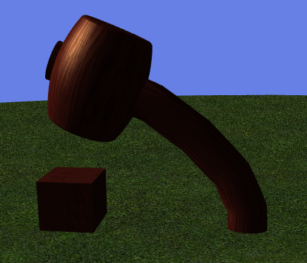

# cocos3d(6)
## 网格
一个网格定义一个物体的表面的形状，通过定义一组包含有关在表面上的每个点的位置和视觉指定信息的顶点。

在Cocos3D，网格由实例所代表的CC3Mesh类。内3D场景中，每个网格节点保存单个网格和单一材料，形成了一个1：网状和覆盖它的材料1之间的关系。

由于网格的含量可以是相当庞大，并且在性质上是一般静态的，一个单一的CC3Mesh实例可以（并且应该）进行了若干之间共享CC3MeshNode的情况下，以节约存储器。当您复制一个CC3MeshNode情况下，CC3Mesh它持有的实例是不可复制的，但是到了单一的引用CC3Mesh是原始的和新的网格节点之间共享。你可以使用这个技术，而无需创建的所有定义一个僵尸字符网格顶点内容的其他副本创建的僵尸角色的军队。每个僵尸内的每个网格节点可以移动，着色，纹理单独，而只有一个底层网格顶点内容的拷贝在所有那些网格节点之间共享。

### 顶点内容
每个顶点，一个筛网可以支持几种类型的内容，其限定在该顶点附近的网格表面的以下方面：

位置（顶点位置）。
表面法线。
表面相切。
表面二重（又名副法线）
表面颜色。
纹理坐标多重纹理。
骨骼动画骨骼权重。
骨骼动画骨基质指数。
每个这些顶点方面被保持在一个单独的顶点数组，在表示Cocos3D通过的一个实例CC3VertexArray，并且每个顶点数组是通过在一个单独的属性进行访问CC3Mesh的实例。每个CC3VertexArray实例维护用于在网格的所有顶点这方面的内容。

例如，包含基本的位置和表面正常含量为每个顶点网格将举行两次CC3VertexArray的情况下，一个在vertexLocations属性，一个在vertexNormals财产。

这是真实的，即使顶点内容交错，这意味着对于一个顶点的所有内容都保存在内存中在一起。在这种情况下，所有的CC3VertexArray内实例CC3Mesh将指向相同的内存空间，每个保持一个单独的字节偏移量，以指示在该具体方面中交错内容（例如-位置或表面正常）被一个顶点内发现。

在这些性质保持的各顶点数组是一个不同的子类的CC3VertexArray，专门针对内容由顶点数组管理的类型。

为了获得最佳的渲染性能，建议您交错的网格顶点内容，让所有的内容为特定的顶点保存在内存中在一起。


#### 访问顶点内容

可以通过相应的访问为各个顶点内容CC3VertexArray，也可以通过同时在方便存取方法CC3Mesh和CC3MeshNode类。这些方法形成了家族的方法，其签名遵循模式vertex...At:为检索值顶点组分，和setVertex...:at:用于设置顶点分量的值。

例如，您可以通过检索在特定顶点表面法线的价值vertexNormalAt:的方法，你可以用改变值setVertexNormal:at:的方法。上有类似的方法CC3Mesh和CC3MeshNode用于访问上面列出的每个顶点内容组件。

的vertexCount和vertexIndexCount特性上CC3Mesh并CC3MeshNode提供在网格顶点和顶点索引的数量的计数。

使用这些方法，和其他几个人，你其实可以建立一个从无到有的网格编程。

除了 ​​在网内访问各个顶点，你还可以访问各个面的网格。一个面是三个顶点的单个三角形（或在一个线网的线的两个顶点的），并形成基本的绘图图元的网格的。

您可以使用检索面的数量在网格faceCount财产CC3Mesh和CC3MeshNode，然后你可以使用家族face...At:方法来检索有关各个面的信息。例如，该faceAt:方法将返回包含三个顶点的位置的结构中，面对的faceCenterAt:，faceNormalAt:和facePlaneAt:方法将返回中心，正常和平面的脸。

你也可以使用修改整个网格moveMeshOriginTo:和moveMeshOriginToCenterOfGeometry方法转移所有相对于网格的原点的网格顶点。这些方法是有用的，如果你有在一个3D编辑器中创建一个网格，你要移动的枢轴点（围绕网格将位于和旋转的），为了简化它是如何在你的代码操作。


### 骨骼动画
骨骼动画，也称为骨串通，或顶点蒙皮，是通过使矩阵和权重的集合到着色器操纵顶点着色器中的网状物的技术。顶点着色器，然后使用这些权重和矩阵的顶点从其初始缺省移动（或休息位置）到不同的位置。这是在以有组织的方式进行的，使得外观是网状表面的变形或弯曲。

变形重量和矩阵的源是一个骨架骨头。网状表面被设计成是一种有效的皮肤骨骼周围，而作为骨移动时，皮肤变形并与它们一起移动。这种技术经常用来制作动画柔软，有弹性模型，如动画人物或织物。这些模型通常被称为一个软体模型。

在Cocos3D，骨骼是由节点所表示的类型的，CC3Bone。像任何组节点，的实例CC3Bone可以建立成为一个节点组件，以形成骨节点的骨架结构。

覆盖骨头的一个或多个网格，每个实例保持CC3SkinMeshNode，这是一个子类CC3MeshNode专门用于骨骼动画使用。每个CC3SkinMeshNode包含一个或多个CC3SkinSection的领带骨头网格的部分实例。

由于骨节点不包含网格本身，它们是不可见的。您可以通过移动和旋转骨的节点构成骨架操纵的字符。通过在骨架操纵骨节点，网格将变形以匹配骨骼的运动。

骨节点的骨架，沿与皮肤网格节点，被收集到一个单一的下一个节点组件CC3SoftBodyNode实例。此节点代表了整个柔体模型，提出这个CC3SoftBodyNode实例中移动整个模型，包括骨骼和皮肤。

由于软体模型（例如字符）通常相当复杂，有许多骨骼和皮肤切片，几乎总是创建的软体模型和在3D编辑动画，然后输出到POD模式。这是非常困难的编程从头开始创建柔体模型。

为了说明软车身结构刚刚讨论，下面是一个软体槌的快照，从mallet.pod文件，在用于CC3DemoMashUp在演示程序Cocos3D分布：

如从加载的木槌模型POD在文件CC3DemoMashUp演示程序。 

由于加载到Cocos3D，下面是对内容的部分列表 mallet.pod文件：

```
CC3PODResourceNode 'mallet.pod':33
  CC3SoftBodyNode 'mallet.pod-SoftBody':45
    CC3PODSkinMeshNode 'Ellipse01':36 with 1 skin sections (POD index: 2)
    CC3PODBone 'Bone01':39 (POD index: 5)
      CC3PODBone 'Bone02':40 (POD index: 6)
        CC3PODBone 'Bone03':41 (POD index: 7)
          CC3PODBone 'Bone04':42 (POD index: 8)
            CC3PODBone 'Bone05':43 (POD index: 9)
              CC3PODBone 'Bone06':44 (POD index: 10)
```

该清单显示了一个单一的蒙皮网格节点和骨骼的一个骨架。蒙皮网格节点和骨架是根据所收集在一起CC3SoftBodyNode，它代表了整个槌模型。虽然此房源没有显示，包含在POD文件动画摆动骨节点来回摆动锤灵活，卡通类，地来回穿梭，在中间摇摆描绘在上面的图片。整个槌模型可以移动，旋转或缩放，通过移动，旋转或缩放的CC3SoftBodyNode实例。

可以生成类似，对于任何上面显示的列表CC3Node实例及其后代通过检索的值structureDescription在装配的顶部节点的属性。上面的清单不包括下整个节点装配结构CC3PODResourceNode从以加 ​​载mallet.pod文件。它省略了一个数字，是柔体节点外的节点。

由于重量和矩阵必须被传递到着色动画皮肤网，任何字符的复杂性是由可传递到着色器在一个单一的绘制调用骨骼的数量的限制。由于每个矩阵消耗16浮点值，这个限制通常是相当小的，在10骨骼附近。

然而，如果骨节点只改变刚性的，这意味着它们可以被移动和旋转，但并非缩放，没有被着色需要为每个骨一个全矩阵，并且可以增加能够被包括在骨的数一个绘图调用显著通过确保只有骨架牢固地变换。

您可以通过调用做到这一点ensureRigidSkeleton的方法CC3SoftBodyNode。此方法将scale在字符的所有骨头财产(1,1,1)，并禁用的任何进一步的动画scale属性在骨节点，确保骨架只会刚性变换。后ensureRigidSkeleton方法被调用，所述着色器匹配随后将选择一个顶点着色器，使得使用这种限制，以提高性能。

该ensureRigidSkeleton方法只限制骨节点的缩放。调用此方法后，你仍然可以扩展软体字符作为一个整体（让你的性格更大或更小），通过设置scale或uniformScale属性的CC3SoftBodyNode实例。
### 顶点缓冲区
由于网的内容在本质上是大部分静态，性能可以通过上传内容网到由直接访问图形内存缓冲区可以提高GPU。这些专门的缓冲器被称为顶点缓冲区。

在Cocos3D，您可以通过调用上传网内容顶点缓冲区createGLBuffers任何节点（在方法CC3Node或子类）。这种方法将上传的所有后代节点网格内容到由GPU访问顶点缓冲区。你甚至可以调用整个场景（您的自定义这个方法CC3Scene的子类），以在上传到GPU内存场景中所有内容的网。

一旦你已经上传了网格的GPU，现在有在内存中网内容两个副本，一个在GPU的内存空间，以及一个主应用程序的内存空间。一旦上传至GPU，在应用存储网格不再用来渲染网格，并且可以从主内存使用删除网格releaseRedundantContent方法。通常情况下，你会调用同一个节点上这种方法在其上调用的createGLBuffers方法（通常在代码背到背台词）。

在某些情况下，您可能希望保留部分或全部网格中的应用程序存储空间，例如，如果您需要进行更改，以网格内容本身。

保留在应用程序存储器的网格的最简单的方法是避免在调用releaseRedundantContent方法。然而，因为它往往是要释放大部分，但不是全部，网格在场景中的情况下，也可以表明你想之前调用保留其目内容releaseRedundantContent的方法。您可以通过调用家族之一做到这一点retainVertex...您要保留在主内存中的应用程序内容网格上的任何网状节点（或节点组装）方式。

选择您要在应用程序内存保留其目内容的能力是相当灵活。您可以使用retainVertexContent保留整个网格。或者，如果网格内容不交错，你也可以调用更具体的方法，如retainVertexLocations，或retainVertexNormals只保留一些网格内容。如果网的内容是交错（共享相同的内存空间），你只能选择保留或该网格内释放所有内容（retainVertexContent）。

调用这些之后retainVertex...方法，你可以然后调用releaseRedundantContent释放所有其他网格内容的方法。

对于您目内容修改主应用程序内存，可以通过调用上传这个变化的网内容updateGLBuffers的方法CC3Mesh和CC3MeshNode实例。

当你不想上传一些网格内容GPU内存由于某些原因的情况下，你可以调用的家庭之一，doNotBufferVertex...之前调用方法createGLBuffers的方法。这保证在确定的顶点内容doNotBufferVertex...方法将不被上传到顶点缓冲器，并且将保留在应用程序存储器。


